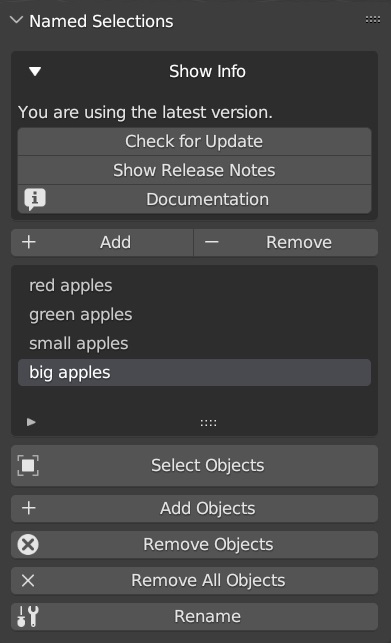

# Blender Named Selection Add-on

## Introduction
The Blender Named Selection Add-on allows you to create a named selection for one or more selected objects directly from the viewport.  

## Key Benefit
Objects in a named selection can be quickly selected with a single button click.

## Installation
To install the Named Selection Add-on in Blender, follow these steps:
1. Download the `NamedSelection.py` file from this repository.
2. Open Blender and go to `Edit > Preferences > Add-ons`.
3. Click `Install` and navigate to the downloaded `.py` file.
4. Select the file and click `Install Add-on`.
5. Enable the add-on by ticking the checkbox next to its name.

## Video Tutorial
For a detailed guide on how to use the Blender Named Selection Add-on, watch our [video tutorial on YouTube](https://www.youtube.com/watch?v=fnlghrXpp94).

## Usage
Once installed, the add-on can be accessed in the 3D Viewport under the sidebar (press `N` to toggle). 

### Interface

1. **Show Info Panel**: Display options for checking for new updates, viewing online release notes and documentation.
2. **Add and Remove Named Selections**: Buttons for adding a new named selection or removing an existing one.
3. **Named Selection List**: A list that displays all the named selections.
4. **Manage Named Selection**: The buttons below the named selection list lets you select objects in a named selection, add or remove objects from it, remove all objects in a named selection, add or remove objects from a named selection and rename the named selection.

### Creating a Named Selection
1. Select the objects you want to add to the new named selection in the 3D Viewport.
2. Go to the Named Selections tab in the sidebar.
3. Click `Add` button and enter a name for the selection.

### Removing a Named Selection
1. Select the named object from the named selection listed
2. Click the `Remove` to remove the named selection 

### Selecting Objects in a Named Selection
1. Select the desired named selection from the named selection list
2. Click the Select Objects button located below the Named Selection.   list to select only objects in the Named Selection. 

### Selecting Objects in a Named Selection
1. From the named selection list, select the named selection that contains the objects you want to select.
2. Click the `Select Objects` button located below the Named Selection list. This action  deselects any currently active objects in the viewport and selects only the objects in the named selection.
     - Holding the **SHIFT** key while clicking `Select Objects` appends the objects in the named selection to any currently active selections in the viewport.

### Adding or Removing Objects in a Named Selection
1. Select the objects you want to add or remove in the Blender viewport
2. Select the named selection you want to add the objects to or remove the objects from
3. Click the `Add Objects` or `Remove Objects` button located below the Named Selection list to include or remove the selected objects in the named selection.

### Other Named Selection Features 

- **Remove All Objects**: Use `Remove All Objects` to empty a named selection without deleting it.
- **Rename**: Click `Rename` to change a named selection's name.

## Features
- Create and manage named selections of objects.
- Easily add, remove, and select objects within named selections.
- View all named selections in a user-friendly list.
- Automatically updates selections when objects are deleted.
- Check for Updates: Stay informed about new versions of the add-on.

## Contributing
Contributions to the Named Selection Add-on are welcome. To contribute:
1. Fork the repository.
2. Create a new branch for your feature.
3. Commit your changes.
4. Push to the branch.
5. Submit a pull request.

## License
This project is licensed under [GPLv3](LICENSE). See the LICENSE file for more details.

## Contact
For support, feedback, or inquiries, please contact [KCRWorld] at [kcreative@kcrworld.com].
